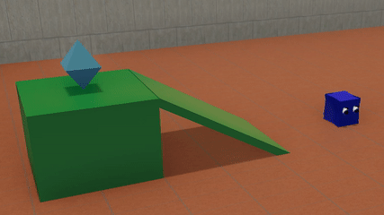
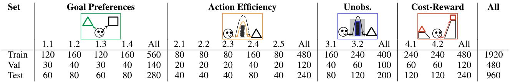

# AGENT: A Benchmark for Core Psychological Reasoning

Code for procedurally synthesizing videos used for constructing the trials in the dataset, AGENT, proposed in the paper: [*AGENT: A Benchmark for Core Psychological Reasoning*](https://www.tshu.io/AGENT/AGENT.pdf).  




## Installation and Running
* Clone the repository
* Download agent 3d models [here](https://agent-dataset-storage.s3.us-east.cloud-object-storage.appdomain.cloud/agent_3d_models.zip)
  and extract the folder inside the `AGENT/` folder
* You can run the script in two modes:  
  * To run trajectories
  ```
  python main.py --out-dir data --config-file configuration_files.json --config-start 0 --config-end 1 --scene-type scene_1
  ```
  * To run replay
  ```
  python main.py --out-dir data --config-file configuration_files.json --config-start 0 --config-end 100 --scene-type replay_scene
  ```


## Dataset Structure Overview
* We provide dataset in two bundles: Training & validation set, and Testing set 
* The dataset is divided into 4 scenarios. 
    * scenario_1_goal_preferences
    * scenario_2_action_efficiency
    * scenario_3_unobserved_constraints
    * scenario_4_cost_reward_trade_offs
* Each scenario is further divided into subtypes.
* Each subtype then contains will then contain train set and validation set or testing set depending on which 
  zip folder you are inside.
* Each of the train, test and validation folders will contain the final trial sets. The number of trials is
  summarized in this 
  
## Trial Structure
* For each trial we provide RGB and Depth map images as well as state data
* Each Trial folder is organized as :
  * Familiarization and expected or unexpected video or both depending on which set (train, validation, test) 
    you are in and have similar structure.
  * Each folder contains:
    * images_c/ folder: Collection of numbered images/frames. Prefix used are: `img_`: RGB, `id_`: Segmentation 
      mask, `depth_`: Depth map
    * Videos: `scene_c.mp4` RGB image video, `mask_scene_c.mp4` segmentation map video, `depth_scene_c.mp4` 
      depth map video
    * state_info.json : This JSON contains list of states. The len of list is equal to number of RBG image/ 
      Depth images/Segmentation mask. Each element in list is dictionary with keys being object name and value 
      being object attributes like position, velocity, rotation, etc. [More information](#more-on-state-data)
    * scene_config.json: This contains dictionary of objects in the scene. This is used by the procedural generation 
      script to recreate the scene.

## More on State Data
* The state data which is list of dictionary, each of which represents state at each frame, uses different keys to 
  represent objects.
* These keys include:
  * `agent`: Agent in the scene. Scenes will always have 1 agent 
  * `goal`, `goal_<side number>`: Goal objects in scene. If there are more than one goal object than it will have number
    indicating which side it is on. 1 is left and 2 is right of agent
  * `obstacle`, `obstacle_<side number>`: This object is the plain wall barrier. Scene with multiple barrier will have 
    side numbers
  * `ramp_slope_<side number>`, `ramp_platform_<side number>`, `ramp_slope`, `ramp_platform`: Each ramp is composed of
    the platform and slope. Each piece has its own set of attributes
  * `barrier_<side number>_with_door_<piece number>`, `barrier_with_door_<piece number>`: This is a plain wall with 
    door cutout in the middle. This obstacle is composed of 3 pieces indicated by the piece number
  * `pit_bridge_<side number>`, `pit_side_part_<side number>`: Pit is formed by 2-3 pieces. In some scenario the pit 
    sides will be connected by bridge
  * `occluder`: In Unobserved constraints' scenario the occluder is used to hide the obstacle. 


## Cite
If you use this code in your research, please consider citing the following the paper.

```
@inproceedings{shu2021agent,
  title={{AGENT}: A Benchmark for Core Psychological Reasoning},
  author={Shu, Tianmin and Bhandwaldar, Abhishek and Gan, Chuang and Smith, Kevin A and Liu, Shari and Gutfreund, Dan and Spelke, Elizabeth and Tenenbaum, Joshua B and Ullman, Tomer D},
  booktitle={The Thirty-eighth International Conference on Machine Learning (ICML)},
  year={2021}
}
```
